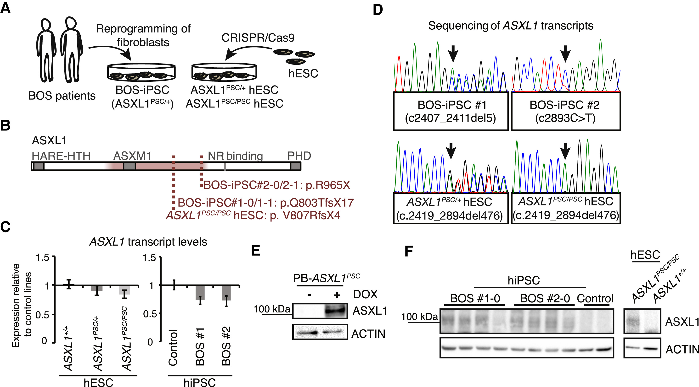
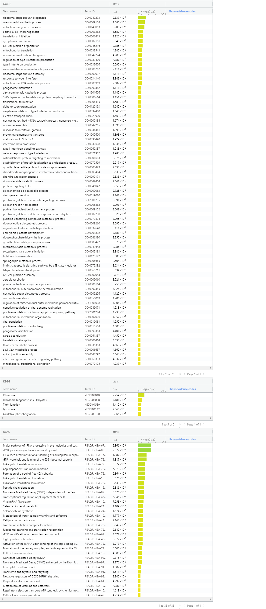
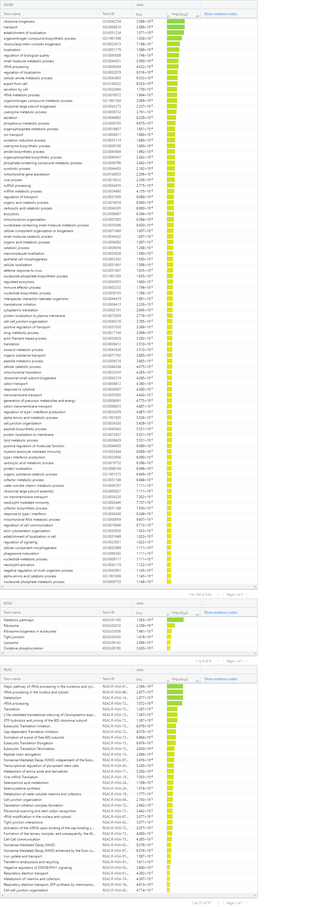
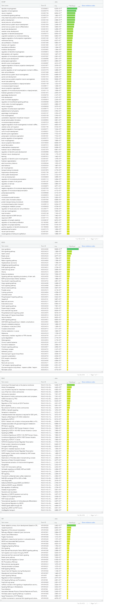
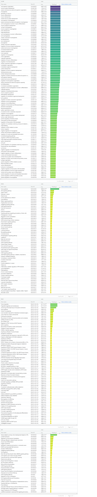
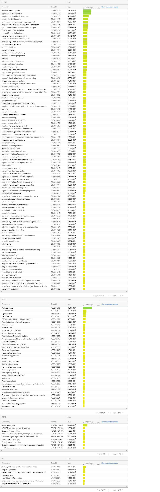
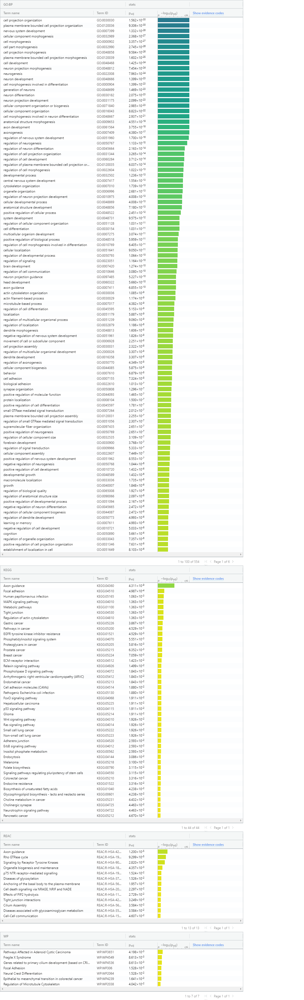

### 0 - Load A1

First, Load the previous assignment.

```{R include=FALSE, eval=TRUE}
knitr::knit("Assignment1.rmd")
```

Note: This loading approach was suggested by [petrelharp](https://stackoverflow.com/questions/24753969/knitr-run-all-chunks-in-an-rmarkdown-document) [@petrelharp_2016].

#### 1 - Dataset recap:

The dataset I used was GSE120200.

##### Brief Description:

Wild type human neurons were cultured that had the ASXL1 gene knocked out. Using various experiments, including injecting the neurons into chicken embryos, the knockout was shown to interfere with neural crest formation.

##### Figure from the paper:


##### Legend: (From paper)
(A) Scheme illustrating the generation of human pluripotent stem cell lines carrying premature stop codon (PSC) mutations in ASXL1.

(B) Scheme of human ASXL1 protein showing annotated domains (NR, nuclear receptor), and locations of mutations frequently reported in BOS patients (red tinted sector) and present in BOS-iPSC and ASXL1PSC/PSC/ASXL1PSC/+ hESC clones.

(C) Expression of ASXL1 in BOS-iPSC lines and ASXL1PSC/PSC/ASXL1PSC/+ hESC clones relative to the respective iPSC/hESC control lines using primers targeting exon 4 (mean ± SEM, n ≥ 3 different clones/passages).

(D) Sequences of reverse transcribed ASXL1 transcripts from ASXL1 mutant lines.

(E) (and F) Representative blotting (n = 3–5 independent experiments) of ASXL1, using a monoclonal antibody raised against the N terminus, in an hESC line overexpressing a truncated ASXL1 variant (PB-ASXL1PSC) (E) and in human iPSC and hESC lines (F).

This figure [@dataset_paper] shows how the cell lines were generated. Essentially it compares the expression and transcripts of the cultured cell model with those of patients with Bohring-Opitz Syndrome and the control, specifically with regards to ASXL1. We can see that the cultured cell model looks similar in results to that of the BOS patients and dissimilar from the control.

#### 2 - Differential gene expression

##### MDS

``` {R}
plotMDS(d, labels=rownames(samples),
  col = c("darkgreen","blue")[factor(samples)])
```
**Figure 2: MDS plot**

Legend:

Green: Homozygous knockout of ASXL1
Blue: Wild type (non-truncated ASXL1)

This plot from A1 shows that WT clusters to one side while HOM clusters to another, and they should, because they are different samples of the same cell cultures. 

As such, the model can be trivially defined by whether it is wild type or HOM.
But does it follow poisson distribution or negative binomial distribution?

``` {R}
plotMeanVar(d, show.raw.vars = TRUE,
            show.tagwise.vars=TRUE, NBline=TRUE, 
            show.ave.raw.vars = FALSE,show.binned.common.disp.vars = TRUE)

```
**Figure 3: Mean Variance Plot**

Legend: Blue line is negative binomial model, black line is poisson model.

Based on the above plot (from A1 as well) we should use a negative binomial model, eg. edgeR, since the distribution follows the negative binomial line.

Since we are using edgeR, we can use the DGEList and model from A1, and we might have to since DGEList takes in raw counts, not normalized counts. Drawback of this is that we will have to remap to HUGO symbols when making the thresholded list for overrepresentation analysis, and we might come across values that we previously filtered out because there was no symbol.

We only have two groups, so we should use exactTest, according to lecture 5. I will also try glmQLFTest as well. We set n to the number of total genes and a standard p value limit of 0.05. We use Benjamini-Hochberg correction because it is the default, and because I'm also going to use it for g:Profiler for the thresholded list analysis.

```{R}
e_t <- exactTest(d, dispersion="auto") #the most complex dispersion in d

uncorrected_table_e<- e_t[["table"]]
uncorrected_table_top_e <- uncorrected_table_e[order(uncorrected_table_e$PValue, decreasing = FALSE),]
uncorrected_table_top_e <- uncorrected_table_top_e[uncorrected_table_top_e$PValue < 0.05,]

head(uncorrected_table_top_e)

tags_e <- topTags(e_t, n=15845, adjust.method="BH", p.value = 1)
#sort(e_t[[table]][[PValue]], decreasing=TRUE)

corrected_table_e = tags_e[["table"]]
head(corrected_table_e)

fit <- glmQLFit(d, model_design)
results <- glmQLFTest(fit, coef=2) #test samplesWT in model design so that null hypothesis is that wild type == HOM mutation

uncorrected_table_g <- results[["table"]]
uncorrected_table_top_g <- uncorrected_table_g[order(uncorrected_table_e$PValue, decreasing = FALSE),]
uncorrected_table_top_g <- uncorrected_table_top_g[uncorrected_table_top_g$PValue < 0.05,]

head(uncorrected_table_top_g)

tags_g <- topTags(results, n=15845, adjust.method="BH", p.value = 1)

corrected_table_g = tags_g[["table"]]
head(corrected_table_g)
```

As we can see, the top hits for both approaches are the same but the glmQLFit approach gives us `r length(which(corrected_table_g$PValue < 0.05))` results compared to the exactTest approach which gives `r length(which(corrected_table_e$PValue < 0.05))` results.

**How many genes pass correction? **

glmQLFit: `r length(which(corrected_table_g$FDR < 0.05))`

exactTest: `r length(which(corrected_table_e$FDR < 0.05))`

Using an approach suggested by Blighe [-@blighe_2018] I now create a volcano plot.

```{R}
insignificant_g = corrected_table_g[which((corrected_table_g$logFC <= 1 & corrected_table_g$logFC >= -1) | corrected_table_g$FDR >= 0.05),]
upregulated_g = corrected_table_g[which(corrected_table_g$logFC > 1 & corrected_table_g$FDR < 0.05),]
downregulated_g = corrected_table_g[which(corrected_table_g$logFC  < -1 & corrected_table_g$FDR < 0.05),]

plot(corrected_table_g$logFC, -log10(corrected_table_g$PValue), pch=20, main = "GLMQLFit Volcano", xlab = "log2(FC)", ylab= "-log10(Adjusted PValue)", col=rgb(0,0,0,0))
points(insignificant_g$logFC, -log10(insignificant_g$PValue), pch=20, col="black")
points(upregulated_g$logFC, -log10(upregulated_g$PValue), pch=20, col="green")
points(downregulated_g$logFC, -log10(downregulated_g$PValue), pch=20, col="red")

insignificant_e = corrected_table_e[which((corrected_table_e$logFC <= 1 & corrected_table_e$logFC >= -1) | corrected_table_g$FDR >= 0.05),]
upregulated_e = corrected_table_e[which(corrected_table_e$logFC > 1  & corrected_table_e$FDR < 0.05),]
downregulated_e = corrected_table_e[which(corrected_table_e$logFC < -1  & corrected_table_e$FDR < 0.05),]

plot(corrected_table_e$logFC, -log10(corrected_table_e$PValue), pch=20, main = "ExactTest Volcano", xlab = "log2(FC)", ylab= "-log10(Adjusted PValue)",  col=rgb(0,0,0,0))
points(insignificant_e$logFC, -log10(insignificant_e$PValue), pch=20, col="black")
points(upregulated_e$logFC, -log10(upregulated_e$PValue), pch=20, col="green")
points(downregulated_e$logFC, -log10(downregulated_e$PValue), pch=20, col="red")

```
**Figure 4, 5: Volcano plots for GLMQLFit and ExactTest approaches**

Legend: Red is significantly downregulated in our model (2 fold change down or more), green is significantly upregulated (2 fold change up or more)

Note that for our model, the design is whether the sample is WT or not. therefore, red is actually upregulated in HOM while green is downregulated in HOM compared to WT.

Now we need to create a thresholded list for the second part of analysis. I will use glmQLFit results because the list is smaller.

``` {R}
corrected_g_gn <- merge(hgnc_table[,1:2], corrected_table_g, by.x = 1, by.y = 0)
head(corrected_g_gn)

corrected_g_gn[,"rank"] <- -log10(corrected_g_gn$PValue) * sign(corrected_g_gn$logFC) *-1
#use -1 to reverse the order so that the upregulated genes are actually upregulated...
corrected_g_gn <- corrected_g_gn[order(corrected_g_gn$rank),]

downregulated_gn <- corrected_g_gn$hgnc_symbol[which(corrected_g_gn$FDR < 0.05 & corrected_g_gn$logFC >0)] #our logFCs are backwards so swap the directions of the logFC comparison.
upregulated_gn <- corrected_g_gn$hgnc_symbol[which(corrected_g_gn$FDR < 0.05 & corrected_g_gn$logFC <0)]

head(upregulated_gn)
head(downregulated_gn)

corrected_g_gn[corrected_g_gn$hgnc_symbol == downregulated_gn[1],]
corrected_g_gn[which(corrected_g_gn$hgnc_symbol == upregulated_gn[1] | corrected_g_gn$hgnc_symbol == upregulated_gn[length(upregulated_gn)]),]

write.table(x=upregulated_gn,
            file="ASXL1_knockout_upreg.txt",sep = "\t",
            row.names = FALSE,col.names = FALSE,quote = FALSE)
write.table(x=downregulated_gn,
            file="ASXL1_knockout_downreg.txt",sep = "\t",
            row.names = FALSE,col.names = FALSE,quote = FALSE)
```

**Major correctness test:**

In the paper there is a supplementary table indicating what they got for top downregulated genes. The top hit for that in terms of P Value is ZIC1.
Note we just called order normally, so it is sorted in increasing order. Hence, downregulated genes first, then upregulated genes.
To confirm our approach, we should see ZIC1 near the top of the downregulated table and we should see that the bottom of the upregulated table should have the highest P values.

Based on the tables and console output above, we do indeed confirm the presence of ZIC1 and that the upregulated table is sorted by lower PValues first.
This supports the results the original paper because it indicates that our analysis passed a small sanity test and that we got one of the same results in our analysis.

**Heatmap**

Using code from Lecture 5:

```{R}
library(ComplexHeatmap)
library(circlize)

top_hits <- rownames(tags_g$table)[tags_g$table$FDR<0.05]
heatmap_matrix_tophits <- t(
  scale(t(normalized_filtered_counts[which(rownames(normalized_filtered_counts) %in% top_hits),])))
if(min(heatmap_matrix_tophits) == 0){
    heatmap_col = colorRamp2(c( 0, max(heatmap_matrix_tophits)), 
                             c( "white", "red"))
  } else {
    heatmap_col = colorRamp2(c(min(heatmap_matrix_tophits), 0, max(heatmap_matrix_tophits)), c("blue", "white", "red"))
  }
current_heatmap <- Heatmap(as.matrix(heatmap_matrix_tophits),
                           cluster_rows = TRUE,
                           cluster_columns = TRUE,
                               show_row_dend = TRUE,
                               show_column_dend = TRUE, 
                               col=heatmap_col,
                               show_column_names = TRUE, 
                               show_row_names = FALSE,
                               show_heatmap_legend = TRUE,
                               )
current_heatmap
```

In this heatmap, the conditions clearly cluster together since in the dendrogram, WT are in a clade and HOM are in another clade. We kind of see a checkerboard pattern between the WT and HOM up and downregulated genes.

#### 2. Thresholded over-representation analysis

* Which method did you choose and why?

    g:Profiler[@raudvere2019g], because we went through the workflow in class already. This was a very arbitrary choice.

* What annotation data did you use and why? What version of the annotation are you using?

    GO:BP, Reactome, WikiPathways, KEGG for fun

    GO:BP – releases/2019-07-01

    REAC – annotations: ensembl

    classes: 2019-10-2

    WP – 20190910

    KEGG – KEGG FTP Release 2019-09-30

* How many genesets were returned with what thresholds?

    **Upregulated list**

    Threshold: 15-10000

    GO:BP – 224 

    KEGG – 6

    REAC –37

    WP - 0

    Threshold: 15-200

    GO:BP – 75

    KEGG – 5

    REAC –33

    WP - 0

    **Downregulated list**

    Threshold: 15-10000

    GO:BP – 689
  
    KEGG – 61

    REAC –70

    WP - 34

    Threshold: 15-200

    GO:BP – 319

    KEGG – 54

    REAC –56

    WP - 33

    **Combined list**

    Threshold: 15-10000

    GO:BP – 554

    KEGG – 44

    REAC –13

    WP - 7

    Threshold: 15-200

    GO:BP – 190

    KEGG – 36

    REAC –9

    WP - 7

    **Figures 6-11: Screenshots from g:Profiler**

    

    

    

    

    

    

     

* How do these results compare to using the whole list (i.e all differentially expressed genes together vs. the up-regulated and down regulated differentially expressed genes separately)?

    It seems that there is not much correlation between the two upregulated and downregulated lists. However, by combining both up and regulated lists, we seem to get more accurate results. For instance, in the wikipathways result for the combined list, we get "Neural Crest Differentiation" which was the focus of the study in the first place. This over-representation result actually supports the conclusion of the original paper, that the knockout of ASXL1 affects neural crest differentiation. However, the P-value isn't the highest overall for the annotation dataset.

### References
