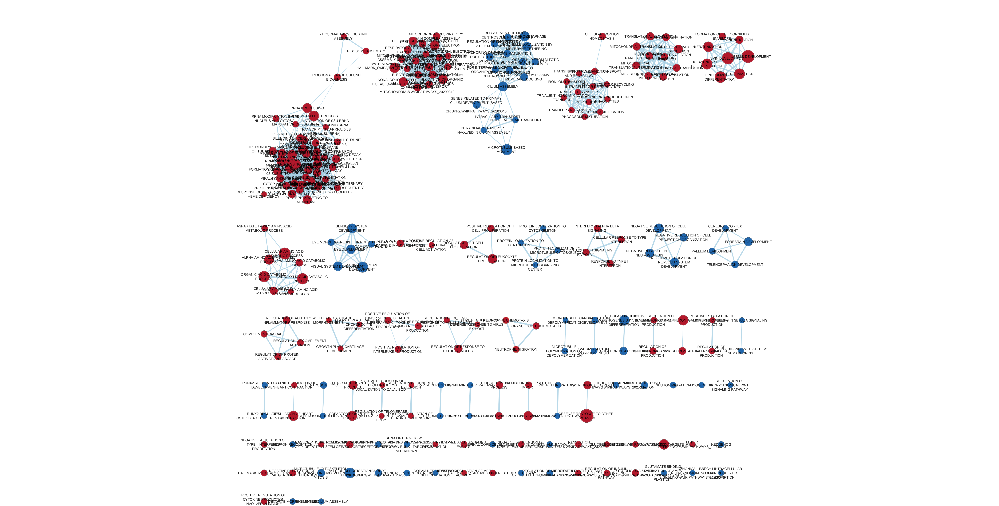
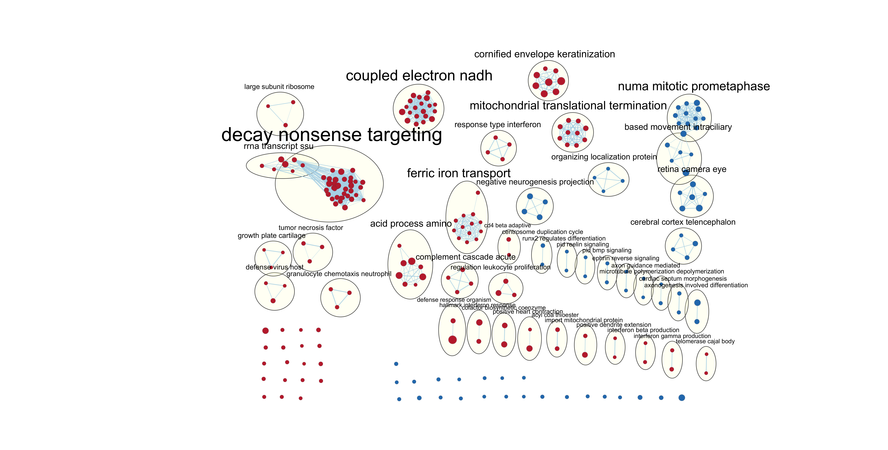
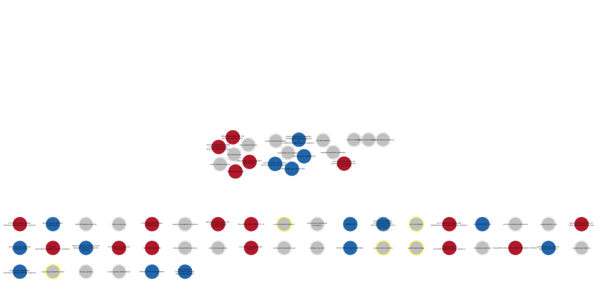

#### 0 - Load A1 and A2

First, Load the previous assignment.

```{R include=FALSE, eval=TRUE}
knitr::knit("A2_YiFeiHuang.rmd")
```

#### 1 - Dataset recap:

The dataset I used was GSE120200.

##### Brief Description:

Wild type human neurons were cultured that had the ASXL1 gene knocked out. Using various experiments, including injecting the neurons into chicken embryos, the knockout was shown to interfere with neural crest formation.

##### Figure from the paper:


##### Legend: (From paper)
(A) Scheme illustrating the generation of human pluripotent stem cell lines carrying premature stop codon (PSC) mutations in ASXL1.

(B) Scheme of human ASXL1 protein showing annotated domains (NR, nuclear receptor), and locations of mutations frequently reported in BOS patients (red tinted sector) and present in BOS-iPSC and ASXL1PSC/PSC/ASXL1PSC/+ hESC clones.

(C) Expression of ASXL1 in BOS-iPSC lines and ASXL1PSC/PSC/ASXL1PSC/+ hESC clones relative to the respective iPSC/hESC control lines using primers targeting exon 4 (mean ± SEM, n ≥ 3 different clones/passages).

(D) Sequences of reverse transcribed ASXL1 transcripts from ASXL1 mutant lines.

(E) (and F) Representative blotting (n = 3–5 independent experiments) of ASXL1, using a monoclonal antibody raised against the N terminus, in an hESC line overexpressing a truncated ASXL1 variant (PB-ASXL1PSC) (E) and in human iPSC and hESC lines (F).

This figure [@dataset_paper] shows how the cell lines were generated. Essentially it compares the expression and transcripts of the cultured cell model with those of patients with Bohring-Opitz Syndrome and the control, specifically with regards to ASXL1. We can see that the cultured cell model looks similar in results to that of the BOS patients and dissimilar from the control.

###### Previously:

We discarded low counts below 3 and applied TMM normalization to the dataset. We made an MDS plot that showed that WT clusters with WT and HOM clusters with other HOM, so our simple model of is WT or not suffices as a reasonable model. We looked at a mean-variance plot and noticed that the data corresponds closely with the negative binomial line.
Hence, we used edgeR which uses negative binomial models with glmQFTest for the final list of results.


#### 2 - Create ranked gene list for GSEA

```{R}
#corrected_g_gn holds our gene list so pull hgnc_symbol and rank and use that
write.table(x=corrected_g_gn[,c("hgnc_symbol", "rank")],
            file="ASXL1_gsea_list.rnk",sep = "\t",
            row.names = FALSE,col.names = FALSE,quote = FALSE)
```

We then feed this result to GSEA and run it.
I used GSEA 4.0.3. The geneset I used was from Bader lab, Human_GOBP_AllPathways_no_GO_iea_March_01_2020. 

GSEA Results


GSEA seems to have results that are extremely similar to that of the thresholded list, except instead of separate categories for each data source they are all combined together in one list, compared to g:profiler. Some categories are moved up and down, but if I go looking for specific categories in one list I will find it somewhere in the other results list. This is not a straightforward comparison because g:profiler has separated categories while GSEA combines them together, likely due to geneset used, so overall ranking will be skewed due to the combined lists.
 
GSEA Top upregulated gene list details
```{R}
head(read.table(file="./a3_figures/gseatopPos.txt",sep = "\t"))
```


#### 3: Cytoscape Enrichment Map

An enrichment map was created in Cytoscape 3.7.2 using the Cytoscape extension EnrichmentMap3.30Beta (latest release on github as of 04/06/2020) as well as the EnrichmentMap Pipeline Collection 1.1.0 (latest version installable from Cytoscape as of 04/06/2020).

The map was created using the interface within Cytoscape, not from GSEA. Settings were left at default.
FDR cutoff: 0.1
p-value cutoff: 1.0
NES: All
Not filtering by minimum experiments
baderlab names parsed
Data Set Edges Automatic
Cutoff: 0.375
Metric: Jaccard + Overlap combined, ratio 50/50



There were 490 nodes and 1941 edges.

The network was annotated using the Cytoscape extension AutoAnnotate 1.3.2

Settings were left mostly at default.
Using clusterMaker App
algorithm: MCL Cluster
edge weight column: similarity_coefficient
+Layout network to prevent cluster overlap

Label column: GS_DESCR
Label Algorithm: WordCloud: Adjacent Words (default)
Max words per label: 3
Adjacent word bonus: 8
Excluded Words and Delimiters default






Do the enrichment results support conclusions or mechanism discussed in the original paper? How do these results differ from the results you got from Assignment #2 thresholded methods?

The GSEA results kind of support the conclusions and/or mechanism discussed in the original paper. Although not in the top results, gene lists relating to neural development and differentiation (neural crest differentiation, hedgehog signalling) were found in the downregulated gene list similar to that in the thresholded list approach. We also see stuff vaguely related to mobility and cell division downregulated in the enrichment map (mitotic, movement, etc), which would support that part of neural crest differentiation is formation of neurospheres and migration. Meanwhile the upregulated list shows things such as rrna transcripts, stuff related to mitochondria and the electron transport chain, and immune response, which seems like things that a cell remaining in interphase would prioritize.

#### 4: Dark matter analysis:

```{R}
if(!require(GSA)){
    install.packages("GSA")
}
library(GSA)
gmt_file <- file.path(getwd(),"data",
                    "Human_GOBP_AllPathways_no_GO_iea_April_01_2020_symbol.gmt")
capture.output(genesets<- GSA.read.gmt(gmt_file),file="gsa_load.out")
names(genesets$genesets) <- genesets$geneset.names

#expression is in hgnc_table
#ranks is corrected_g_gn[,c("hgnc_symbol", "rank")]

#get all the GSEA directories

gsea_directories <- list.files(path = file.path(getwd(),"data"), 
                                 pattern = "\\.GseaPreranked")
if(length(gsea_directories) == 1){
  gsea_dir <- file.path(getwd(),"data",gsea_directories[1])
  #get the gsea result files
  gsea_results_files <- list.files(path = gsea_dir, 
                                 pattern = "gsea_report_*.*.xls")
  #there should be 2 gsea results files
  enr_file1 <- read.table(file.path(gsea_dir,gsea_results_files[1]), 
                        header = TRUE, sep = "\t", quote="\"",  
                        stringsAsFactors = FALSE,row.names=1)
  enr_file2 <- read.table(file.path(gsea_dir,gsea_results_files[1]), 
                        header = TRUE, sep = "\t", quote="\"",  
                        stringsAsFactors = FALSE,row.names=1)
}

#get the genes from the set of enriched pathwasy (no matter what threshold)
all_enr_genesets<- c(rownames(enr_file1), rownames(enr_file2))
genes_enr_gs <- c()
for(i in 1:length(all_enr_genesets)){
  current_geneset <- unlist(genesets$genesets[which(genesets$geneset.names %in% all_enr_genesets[i])]) 
  genes_enr_gs <- union(genes_enr_gs, current_geneset)
}

#FDR_threshold <- 0.001
#get the genes from the set of enriched pathway (no matter what threshold)
#all_sig_enr_genesets<- c(rownames(enr_file1)[which(enr_file1[,"FDR.q.val"]<=FDR_threshold)], rownames(enr_file2)[which(enr_file2[,"FDR.q.val"]<=FDR_threshold)])
#genes_sig_enr_gs <- c()
#for(i in 1:length(all_sig_enr_genesets)){
#  current_geneset <- unlist(genesets$genesets[which(genesets$geneset.names %in% all_sig_enr_genesets[i])]) 
#  genes_sig_enr_gs <- union(genes_sig_enr_gs, current_geneset)
#}

genes_all_gs <- unique(unlist(genesets$genesets))

genes_no_annotation <- setdiff(hgnc_table[,2], genes_all_gs)

ranks <- corrected_g_gn[,c("hgnc_symbol", "rank")]

ranked_gene_no_annotation <- ranks[which(ranks[,1] %in% genes_no_annotation),]

head(ranked_gene_no_annotation)

genes_no_enr_annotation <- setdiff(hgnc_table[,2], genes_sig_enr_gs)

ranked_gene_no_enr_annotation <- ranks[which(ranks[,1] %in% genes_no_enr_annotation),]

head(ranked_gene_no_enr_annotation)


```


```{R}
#heatmap for any significant genes that are not annotated to any of the pathways returned in the enrichment analysis
heatmap_matrix_tophits <- t(
  scale(t(final_a1_data[which(rownames(final_a1_data) %in% ranked_gene_no_enr_annotation[,1]),])))
if(min(heatmap_matrix_tophits) == 0){
    heatmap_col = colorRamp2(c( 0, max(heatmap_matrix_tophits)), 
                             c( "white", "red"))
  } else {
    heatmap_col = colorRamp2(c(min(heatmap_matrix_tophits), 0, max(heatmap_matrix_tophits)), c("blue", "white", "red"))
  }
current_heatmap <- Heatmap(as.matrix(heatmap_matrix_tophits),
                           cluster_rows = TRUE,
                           cluster_columns = TRUE,
                               show_row_dend = TRUE,
                               show_column_dend = TRUE, 
                               col=heatmap_col,
                               show_column_names = TRUE, 
                               show_row_names = FALSE,
                               show_heatmap_legend = TRUE,
                               )
current_heatmap
```

```{R}
#heatmap of any significant genes that are not annotated to any pathways in entire set of pathways used for the analysis.
heatmap_matrix_tophits <- t(
  scale(t(final_a1_data[which(rownames(final_a1_data) %in% ranked_gene_no_annotation[,1]),])))
if(min(heatmap_matrix_tophits) == 0){
    heatmap_col = colorRamp2(c( 0, max(heatmap_matrix_tophits)), 
                             c( "white", "red"))
  } else {
    heatmap_col = colorRamp2(c(min(heatmap_matrix_tophits), 0, max(heatmap_matrix_tophits)), c("blue", "white", "red"))
  }
current_heatmap <- Heatmap(as.matrix(heatmap_matrix_tophits),
                           cluster_rows = TRUE,
                           cluster_columns = TRUE,
                               show_row_dend = TRUE,
                               show_column_dend = TRUE, 
                               col=heatmap_col,
                               show_column_names = TRUE, 
                               show_row_names = FALSE,
                               show_heatmap_legend = TRUE,
                               )
current_heatmap
```

Strangely in the dark matter heatmaps WT 2 does not cluster with WT3 and WT1, but they also don't particularly cluster well with the HOM group as well. Certainly the dark matter has more noise than the genes represented in the gene sets.

#### References
